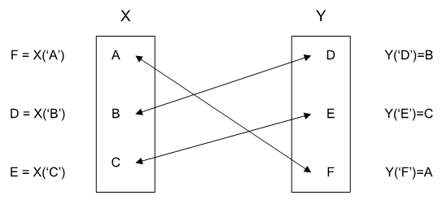

.. aimms:function:: cp::Channel(mapBinding, map, inverseMapBinding, inverseMap)

.. _cp::Channel:

cp::Channel
===========

The function :aimms:func:`cp::Channel` links two arrays of variables such that
they are uniquely matched to each other. For instance, see
:numref:`fig:cp:Channel`. This function is often used to model different perspectives
of the same problem.

   A situation accepted by :aimms:func:`cp::Channel`

Mathematical Formulation
------------------------

    The function ``cp::Channel(i,x_i,j,y_j)`` returns 1 if for all
    :math:`i,j`: :math:`x_i=j` implies :math:`y_j=i` and vice versa.
    ``cp::Channel(i,x_i,j,y_j)`` is equivalent to

.. math:: \forall i,j: x_i=j \Leftrightarrow y_j=i

Function Prototype
------------------

	.. code-block:: aimms
		
		cp::Channel(
			mapBinding,        ! (input) an index binding
			map,               ! (input/output) an expression
			inverseMapBinding, ! (input) an index binding
			inverseMap         ! (input/output) an expression 
			)

Arguments
---------

    *mapBinding*
        The index binding corresponding to the domain of the first expression
        ``map``.

    *map*
        For each element in ``mapBinding``, ``map`` will contain an element in
        ``inverseMapBinding``. This expression may involve variables.

    *inverseMapBinding*
        The index binding corresponding to the domain of the second expression
        ``inverseMap``.

    *inverseMap*
        For each element in ``inverseMapBinding``, ``inverseMap`` will contain
        an element in ``mapBinding``. This expression may involve variables.

Return Value
------------

    If a unique mapping between the two index bindings is created, this
    function returns 1. When the index bindings ``mapBinding`` and
    ``inverseMapBinding`` are both empty, this function returns 1 as well.
    In all other cases, the function returns 0, e.g. when the number of
    possible values of index binding ``mapBinding`` is different from that
    of the index binding ``inverseMapBinding``.

.. note::

    -  The :aimms:func:`cp::Channel` constraint is also referred to in the Constraint
       Programming literature as ``Inverse``.

    -  The :aimms:func:`cp::Channel` constraint can be used to implement the
       ``one_factor(i,x(i))`` or ``symm_AllDifferent(i,x(i))`` constraints
       encountered in the Constraint Programming literature as
       ``cp::Channel(i,X(i),i,X(i))``.

Example
-------

    In a sports team scheduling problem, the following constraint

    .. code-block:: aimms

            Constraint LinkingDuplicateView {
                Definition :  cp::Channel( s, Games(s), g, Slots(g) );
            }

    links the variable ``Games(s)`` to the variable
    ``Slots(g)``. A game is the identification number of a match between a
    home and an away team. A slot is the identification number of a week and
    a match within a week number. For each game, there is a unique slot and
    for each slot there is a unique game.

.. seealso::

    -  :doc:`optimization-modeling-components/constraint-programming/index` on Constraint Programming in the `Language Reference <https://documentation.aimms.com/language-reference/index.html>`__.

    -  The `Global Constraint Catalog <https://web.imt-atlantique.fr/x-info/sdemasse/gccatold/>`__, which
       references this function as ``inverse``.
