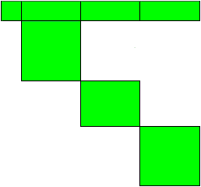

.. aimms:function:: GMP::Instance::CreateBlockMatrices(GMP, colSet, blockValue, prefix)

.. _GMP::Instance::CreateBlockMatrices:

GMP::Instance::CreateBlockMatrices
==================================

| The function :aimms:func:`GMP::Instance::CreateBlockMatrices` generates a set
  of generated mathematical programs that are independent block representations
  of the specified generated mathematical program. In other words, the original
  generated mathematical program will be partitioned into multiple generated
  mathematical programs.
|
| The mathematical program visualized in :numref:`fig:gmp:blocks` contains three
  blocks (the first row and column represent the objective). This model can be
  solved by solving each block separately, and combining the solutions.
  

   
   A mathematical program with three blocks

.. code-block:: aimms

    GMP::Instance::CreateBlockMatrices(
         GMP,            ! (input) a generated mathematical program
         colSet          ! (input) a subset of Integers
         blockValue      ! (input) an integer parameter
         prefix          ! (input) a string expression
    )

Arguments
---------

    *GMP*
        An element in the set :aimms:set:`AllGeneratedMathematicalPrograms`.

    *colSet*
        A subset of the set :aimms:set:`Integers`, representing a set of column
        numbers. This set may be empty.

    *blockValue*
        An integer parameter over *colSet* indicating the (nonnegative) block value
        for each column in *colSet*.

    *prefix*
        A string that holds the prefix used to create the names of each generated
        mathematical program that is created by this function.

Return Value
------------

    A subset of the set :aimms:set:`AllGeneratedMathematicalPrograms`. The subset
    will be empty in case of an error.

.. note::

    -  The *GMP* must be linear.

    -  The objective column will be copied to every block GMP. The objective row
       also, but it will only include the columns assigned to that block GMP.

    -  The *blockValue* of the objective column will be ignored (because the
       objective column will be copied to every block GMP).

    -  A *blockValue* of 0 for a certain column means that AIMMS will automatically
       assign that column to a block.

    -  The user can specify the *blockValue* for every column in the *GMP*,
       in which case this function will create block GMP's based on this partition.
       If a different non-zero *blockValue* is assigned to two columns, and it turns
       out that the two corresponding blocks are not independent, then this function
       will generate an error. If two columns are assigned the same non-zero *blockValue*
       then these columns will be assigned to the same block, even if this block could
       be partitioned into two blocks.

    -  If *colSet* is empty, or if *blockValue* equals 0 for each column, then AIMMS
       will create block matrices automatically, and as many as possible.
       If the *GMP* cannot be partitioned in multiple block GMP's then
       the returned subset of the set :aimms:set:`AllGeneratedMathematicalPrograms`
       will only contain one element, namely a copy of the *GMP*.

    -  It is possible to assign a (positive) *blockValue* for a subset of the columns.
       This function will then automatically assign the other columns to block GMP's.

    -  The *prefix* argument is used to create the names of the block GMP's, which will
       consist of the *prefix* value followed by the block number. The block numbers
       correspond to the *blockValue* assigned to (a selection of) the columns. If
       extra block GMP's are created (besides those specified through the *blockValue*
       argument) then their numbering will start at the largest *blockValue* plus one.
       (And if the *colSet* is empty, or if *blockValue* equals 0 for each column, then
       the numbering will start at one.)

    -  If the objective row contains an objective constant then this will be added to the
       last block GMP only. And in the unusual situation that the *GMP* contains columns
       (besides the objective column) that only appear in the objective row, then these
       columns will also be assigned to the last block GMP.

Example
-------

    Assume that 'MP' is a mathematical program with the following
    declaration (in ams format): 

    .. code-block:: aimms

               Set Periods {
                   Index: t;
                   Definition: {
                       { 'per-1', 'per-2', 'per-3' }
                   }
               }
               Variable x {
                   IndexDomain: t;
                   Range: nonnegative;
               }
               Variable y {
                   IndexDomain: t;
                   Range: nonnegative;
               }
               Variable obj {
                   Definition: sum( t, 7 * x(t) - 2 * y(t) );
               }
               Constraint c1 {
                   IndexDomain: t;
                   Definition: - x(t) + 2 * y(t) <= 4;
               }
               MathematicalProgram MP {
                   Objective: obj;
                   Direction: minimize;
                   Type: LP;
               }

    To use
    :aimms:func:`GMP::Instance::CreateBlockMatrices` we declare the following identifiers
    (in ams format):
    
    .. code-block:: aimms

               ElementParameter myGMP {
                   Range: AllGeneratedMathematicalPrograms;
               }
               Set GMPset {
                   SubsetOf: AllGeneratedMathematicalPrograms;
                   Parameter: CurrentGMP;
               }
               ElementParameter session {
                   Range: AllSolverSessions;
               }
               Set ColumnSet {
                   SubsetOf: Integers;
                   Index: cc;
               }
               Parameter BlockVals {
                   IndexDomain: cc;
               }
               StringParameter ColumnName {
                   IndexDomain: cc;
               }

    To create block matrices and solve them to create a solution for the original model
    we can use: 

    .. code-block:: aimms

               myGMP := GMP::Instance::Generate( FlowShopModel );
               
               ColumnSet := GMP::Instance::GetColumnNumbers( myGMP, AllVariables );
               
               for (cc) do
                   ColumnName(cc) := GMP::Column::GetName( myGMP, cc );
               endfor;
               
               BlockVals(cc) := 0;
               
               for (cc) do
                   if ( FindString( ColumnName(cc), "per-1" ) ) then
                       BlockVals(cc) := 1;
                   elseif ( FindString( ColumnName(cc), "per-2" ) ) then
                       BlockVals(cc) := 2;
                   else
                       BlockVals(cc) := 3;
                   endif;
               endfor;
               
               GMPset := GMP::Instance::CreateBlockMatrices( myGMP, ColumnSet, BlockVals, "block-" );
               
               while ( Card(GMPset) >= 1 ) do
                   CurrentGMP := First(GMPset);
               
                   session := GMP::Instance::CreateSolverSession( CurrentGMP );
               
               	   GMP::SolverSession::Execute( session );
               
                   GMP::Solution::RetrieveFromSolverSession( session, 1 );
                   if ( Card(GMPset) = 1 ) then
    	               GMP::Solution::SendToModel( CurrentGMP, 1, merge : 1, evalInline : 1 );
                   else
    	               GMP::Solution::SendToModel( CurrentGMP, 1, merge : 1, evalInline : 0 );
                   endif;
               
                   GMP::Instance::Delete( CurrentGMP );
               endwhile;
               
               GMP::Instance::Delete( myGMP );

    The above piece of code creates three block GMP's (with names "block-1", "block-2" and "block-3").
    This is also the case if 'ColumnSet' or 'BlockVals' would have been empty. If we assign the block
    values as follows then only two blocks will be created:

    .. code-block:: aimms

               BlockVals(cc) := 0;
               
               for (cc) do
                   if ( FindString( ColumnName(cc), "per-1" ) ) then
                       BlockVals(cc) := 1;
                   else
                       BlockVals(cc) := 2;
                   endif;
               endfor;

    In this case the columns corresponding to the periods "per-2" and "per-3" will be assigned to the
    same block GMP (with the name "block-2").
    
.. seealso::

    The routines :aimms:func:`GMP::Instance::CreateSolverSession`, :aimms:func:`GMP::Instance::Generate`, :aimms:func:`GMP::Solution::RetrieveFromSolverSession`,
    :aimms:func:`GMP::Solution::SendToModel` and :aimms:func:`GMP::SolverSession::Execute`.
