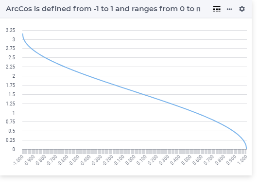

.. aimms:function:: ArcCos(x)

.. _ArcCos:

ArcCos
======

.. code-block:: aimms

    ArcCos(
          x             ! (input) numerical expression
          )

Arguments
---------

    *x*
        A scalar numerical expression in the range :math:`[-1,1]`.
		
Graph
-----------------

Example
-----------

.. code-block:: aimms

	_p_returnM1 := arcCos(-1); ! returns pi
	_p_returnZ  := arcCos( 0); ! returns half pi
	_p_returnP1 := arcCos( 1); ! returns 0

Return Value
------------

    The :aimms:func:`ArcCos` function returns the arccosine of *x* in the range 0 to
    :math:`\pi` radians.

.. note::

    -  A run-time error results if *x* is outside the range :math:`[-1,1]`.

    -  The function :aimms:func:`ArcCos` can be used in constraints of nonlinear
       mathematical programs.

.. seealso::

    -   The functions :aimms:func:`ArcSin`, :aimms:func:`ArcTan`, :aimms:func:`Cos`. Arithmetic functions are
        discussed in full detail in :ref:`sec:expr.num.functions` of the `Language Reference <https://documentation.aimms.com/language-reference/index.html>`__.
        
    -   `Wikipedia <https://en.wikipedia.org/wiki/Inverse_trigonometric_functions>`_
