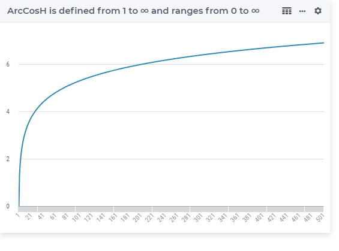

.. aimms:function:: ArcCosh(x)

.. _ArcCosh:

ArcCosh
=======

.. code-block:: aimms

    ArcCosh(
           x             ! (input) numerical expression
           )

Arguments
---------

    *x*
        A scalar numerical expression in the range :math:`[1,\infty)`.

Graph
----------

Example
----------------

.. code-block:: aimms

	_p_return1   := arcCosH(1);   ! returns 0
	_p_return1e3 := arcCosH(1e3); ! returns 7.60
	_p_return1e6 := arcCosH(1e6); ! returns 14.51
	_p_return1e9 := arcCosH(1e9); ! returns 21.42
	_p_return0   := arcCosH(0);   ! Runtime error

Return Value
------------

    The :aimms:func:`ArcCosh` function returns the inverse hyperbolic cosine of *x* in
    the range from :math:`0` to :math:`\infty`.

.. note::

    -  A run-time error results if *x* is outside the range
       :math:`[1,\infty]`.

    -  The function :aimms:func:`ArcCosh` can be used in constraints of nonlinear
       mathematical programs.

.. seealso::

    -   The functions :aimms:func:`ArcSinh`, :aimms:func:`ArcTanh`, :aimms:func:`Cosh`. Arithmetic functions are
        discussed in full detail in :ref:`sec:expr.num.functions` of the `Language Reference <https://documentation.aimms.com/language-reference/index.html>`__.

    -   `Wikipedia <https://en.wikipedia.org/wiki/Inverse_hyperbolic_functions>`_
