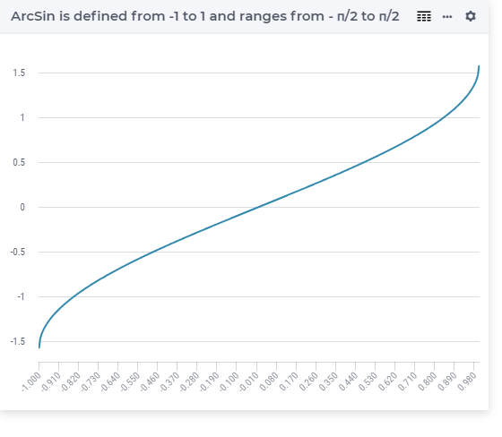

.. aimms:function:: ArcSin(x)

.. _ArcSin:

ArcSin
======

.. code-block:: aimms

    ArcSin(
          x             ! (input) numerical expression
          )

Arguments
---------

    *x*
        A scalar numerical expression in the range :math:`[-1,1]`.

Return Value
------------

    The :aimms:func:`ArcSin` function returns the arcsine of *x* in the range
    :math:`-\pi/2` to :math:`\pi/2` radians.

		
Graph
--------

Example
-----------------

.. code-block:: aimms

	_p_returnM1 := arcSin(-1); ! returns -pi/2
	_p_returnZ  := arcSin( 0); ! returns 0
	_p_returnP1 := arcsin( 1); ! returns pi/2

.. note::

    -  A run-time error results if *x* is outside the range :math:`[-1,1]`.

    -  The function :aimms:func:`ArcSin` can be used in constraints of nonlinear
       mathematical programs.

.. seealso::

    -   The functions :aimms:func:`ArcCos`, :aimms:func:`ArcTan`, :aimms:func:`Sin`. Arithmetic functions are
        discussed in full detail in :ref:`sec:expr.num.functions` of the `Language Reference <https://documentation.aimms.com/language-reference/index.html>`__.

    -   `Wikipedia <https://en.wikipedia.org/wiki/Inverse_trigonometric_functions>`_
