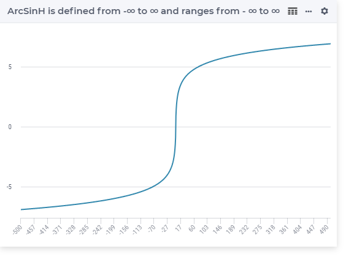

.. aimms:function:: ArcSinh(x)

.. _ArcSinh:

ArcSinh
=======

.. code-block:: aimms

    ArcSinh(
           x             ! (input) numerical expression
           )

Arguments
---------

    *x*
        A scalar numerical expression.

Graph
--------

Example
-----------------

.. code-block:: aimms

	_p_returnA := arcSinH(-1e9); ! returns -21.416413017506
	_p_returnB := arcSinH(-1e3); ! returns -7.600902709542
	_p_returnC := arcsinH( 0.0); ! returns 0
	_p_returnD := arcSinH( 1e3); ! returns 7.600902709542
	_p_returnE := arcSinH( 1e9); ! returns 21.416413017506

Return Value
------------

    The :aimms:func:`ArcSinh` function returns the inverse hyperbolic sine of *x* in
    the range from :math:`-\infty` to :math:`\infty`.

.. note::

    The function :aimms:func:`ArcSinh` can be used in constraints of nonlinear
    mathematical programs.

.. seealso::

    -   The functions :aimms:func:`ArcCosh`, :aimms:func:`ArcTanh`, :aimms:func:`Sinh`. Arithmetic functions are
        discussed in full detail in :ref:`sec:expr.num.functions` of the `Language Reference <https://documentation.aimms.com/language-reference/index.html>`__.

    -   `Wikipedia <https://en.wikipedia.org/wiki/Inverse_hyperbolic_functions>`_
