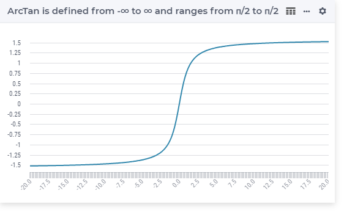

.. aimms:function:: ArcTan(x)

.. _ArcTan:

ArcTan
======

.. code-block:: aimms

    ArcTan(
          x             ! (input) numerical expression
          )

Arguments
---------

    *x*
        A scalar numerical expression.

Return Value
------------

    The :aimms:func:`ArcTan` function returns the arctangent of *x* in the range
    :math:`-\pi/2` to :math:`\pi/2` radians.

Graph
-----------------

Example
-----------

.. code-block:: aimms

	_p_returnM1 := arcTan(-1e9); ! returns almost -pi/2
	_p_returnZ  := arcTan( 0); ! returns 0
	_p_returnP1 := arcTan( 1e9); ! returns almost pi/2

.. note::

    The function :aimms:func:`ArcTan` can be used in constraints of nonlinear
    mathematical programs.

.. seealso::

    -   The functions :aimms:func:`ArcSin`, :aimms:func:`ArcCos`, :aimms:func:`Tan`. Arithmetic functions are
        discussed in full detail in :ref:`sec:expr.num.functions` of 
        the `Language Reference <https://documentation.aimms.com/language-reference/index.html>`__.
        
    -   `Wikipedia <https://en.wikipedia.org/wiki/Inverse_trigonometric_functions>`_
