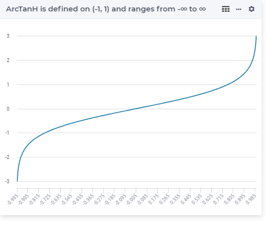

.. aimms:function:: ArcTanh(x)

.. _ArcTanh:

ArcTanh
=======

.. code-block:: aimms

    ArcTanh(
           x             ! (input) numerical expression
           )

Arguments
---------

    *x*
        A scalar numerical expression in the range :math:`(-1,1)`.

Graph
-----------------

Example
-----------

.. code-block:: aimms

	_p_returnA := arcTanH(-0.99); ! returns -2.646652412362
	_p_returnB := arcTanH( 0   ); ! returns  0
	_p_returnC := arcTanH( 0.99); ! returns  2.646652412362

Return Value
------------

    The :aimms:func:`ArcTanh` function returns the inverse hyperbolic tangent of *x*.

.. note::

    -  A run-time error results if *x* is outside the range :math:`(-1,1)`.

    -  The function :aimms:func:`ArcTanh` can be used in constraints of nonlinear
       mathematical programs.

.. seealso::

    -   The functions :aimms:func:`ArcCosh`, :aimms:func:`ArcSinh`, :aimms:func:`Tanh`. Arithmetic functions are
        discussed in full detail in :ref:`sec:expr.num.functions` of the `Language Reference <https://documentation.aimms.com/language-reference/index.html>`__.

    -   `Wikipedia <https://en.wikipedia.org/wiki/Inverse_hyperbolic_functions>`_
