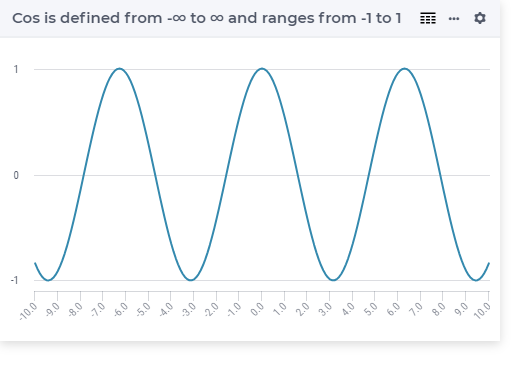

.. aimms:function:: Cos(x)

.. _Cos:

Cos
===

.. code-block:: aimms

    Cos(
       x             ! (input) numerical expression
       )

Arguments
---------

    *x*
        A scalar numerical expression in radians.

Return Value
------------

    The :aimms:func:`Cos` function returns the cosine of *x* in the range :math:`-1`
    to 1.

        
Graph
-----------------

Example
-----------

.. code-block:: aimms

    _p_returnM1 := Cos(-p_pi); ! cos(-pi) = -1
    _p_returnZ  := Cos( 0   ); ! cos( 0 ) =  1
    _p_returnP1 := Cos( p_pi); ! cos( pi) = -1
        
.. note::

    The function :aimms:func:`Cos` can be used in constraints of nonlinear
    mathematical programs.

.. seealso::

    -   The functions :aimms:func:`Sin`, :aimms:func:`Tan`, :aimms:func:`ArcCos`. Arithmetic functions are
        discussed in full detail in :ref:`sec:expr.num.functions` of the `Language Reference <https://documentation.aimms.com/language-reference/index.html>`__.

    -   `Wikipedia <https://en.wikipedia.org/wiki/Sine_and_cosine>`_