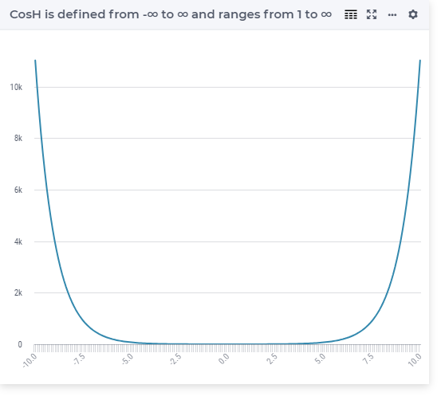

.. aimms:function:: Cosh(x)

.. _Cosh:

Cosh
====

.. code-block:: aimms

    Cosh(
        x             ! (input) numerical expression
        )

Arguments
---------

    *x*
        A scalar numerical expression.
        
Graph
-----------------

Example
-----------

.. code-block:: aimms

	_p_returnM1 := Cosh(-10); ! cosh(-10) = 11013.232920103323
	_p_returnZ  := Cosh( 0 ); ! cosh(  0) =     1
	_p_returnP1 := Cosh( 10); ! cosh( 10) = 11013.232920103323
        

Return Value
------------

    The :aimms:func:`Cosh` function returns the hyperbolic cosine of *x* in the range
    1 to :math:`\infty`.

.. note::

    The function :aimms:func:`Cosh` can be used in constraints of nonlinear
    mathematical programs.

.. seealso::

    -   The functions :aimms:func:`Sinh`, :aimms:func:`Tanh`, :aimms:func:`ArcCosh`. Arithmetic functions are
        discussed in full detail in :ref:`sec:expr.num.functions` of the `Language Reference <https://documentation.aimms.com/language-reference/index.html>`__.

    -   `Wikipedia <https://en.wikipedia.org/wiki/Hyperbolic_functions>`_