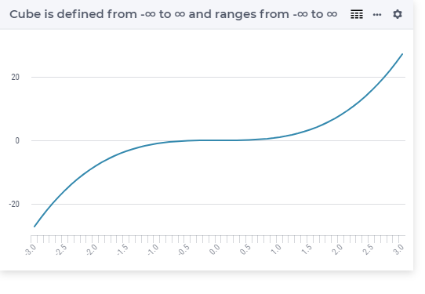

.. aimms:function:: Cube(x)

.. _Cube:

Cube
====

.. code-block:: aimms

    Cube(
        x             ! (input) numerical expression
        )

Arguments
---------

    *x*
        A scalar numerical expression.

Return Value
------------

    The function :aimms:func:`Cube` returns :math:`x^3`.

Graph
-----------------

Example
-----------

.. code-block:: aimms

	_p_returnM1 := Cube(-1); ! Cube(-1) = -1
	_p_returnZ  := Cube( 0); ! Cube( 0) =  0
	_p_returnP1 := Cube( 1); ! Cube( 1) =  1
	_p_returnP2 := Cube( 2); ! Cube( 2) =  8

.. note::

    The function :aimms:func:`Cube` can be used in constraints of nonlinear
    mathematical programs.

.. seealso::

    The functions :aimms:func:`Power`, :aimms:func:`Sqr`, and :aimms:func:`Sqrt`. Arithmetic functions
    are discussed in full detail in :ref:`sec:expr.num.functions` of the `Language Reference <https://documentation.aimms.com/language-reference/index.html>`__.
