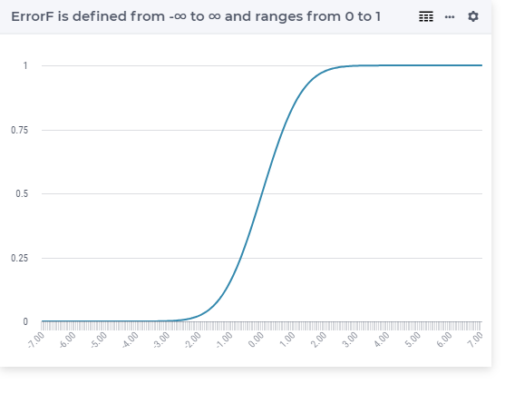

.. aimms:function:: ErrorF(x)

.. _ErrorF:

ErrorF
======

.. code-block:: aimms

    ErrorF(
           x             ! (input) numerical expression
           )

Arguments
---------

    *x*
        A scalar numerical expression.

Return Value
------------

    The function :aimms:func:`ErrorF` returns the error function value
    :math:`{\frac{1}{\sqrt{2\pi}}} \int_{-\infty}^x e^{-{\frac{t^2}{2}}}\, dt`.

        
Graph
-----------------

Example
-----------

.. code-block:: aimms

    _p_returnM1 := ErrorF(-1); ! ErrorF(-1) = 0.158655253931
    _p_returnZ  := ErrorF( 0); ! ErrorF( 0) = 0.5
    _p_returnP1 := ErrorF( 1); ! ErrorF( 1) = 0.841344746069
        

.. note::

    The function :aimms:func:`ErrorF` can be used in constraints of nonlinear
    mathematical programs.

.. seealso::

    -   Arithmetic functions are discussed in full detail in :ref:`sec:expr.num.functions` of
        the `Language Reference <https://documentation.aimms.com/language-reference/index.html>`__.

    -   `Wikipedia <https://en.wikipedia.org/wiki/Error_function>`_