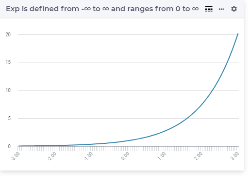

.. aimms:function:: Exp(x)

.. _Exp:

Exp
===

.. code-block:: aimms

    Exp(
        x             ! (input) numerical expression
        )

Arguments
---------

    *x*
        A scalar numerical expression.

Return Value
------------

    The function :aimms:func:`Exp` returns the exponential value :math:`e^x`.

       
Graph
-----------------

Example
-----------

.. code-block:: aimms

    _p_returnM1 := Exp(-1); ! Exp(-1) = 0.367879441171
    _p_returnZ  := Exp( 0); ! Exp( 0) = 1
    _p_returnP1 := Exp( 1); ! Exp( 1) = 2.718281828459

.. note::

    The function :aimms:func:`Exp` can be used in constraints of nonlinear
    mathematical programs.

.. seealso::

    -   The functions :aimms:func:`Log`, :aimms:func:`Log10`. Arithmetic functions are discussed
        in full detail in :ref:`sec:expr.num.functions` of the `Language Reference <https://documentation.aimms.com/language-reference/index.html>`__.

    -   `Wikipedia <https://en.wikipedia.org/wiki/Exponential_function>`_