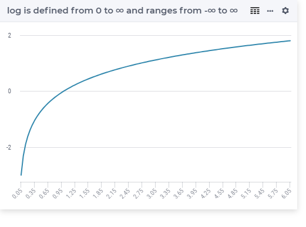

.. aimms:function:: Log(x)

.. _Log:

Log
===

.. code-block:: aimms

    Log(
        x             ! (input) numerical expression
        )

Arguments
---------

    *x*
        A scalar numerical expression in the range :math:`(0,\infty)`.

Return Value
------------

    The function :aimms:func:`Log` returns the natural logarithm :math:`\ln(x)`.

        
Graph
-----------------

Example
-----------

.. code-block:: aimms

    p_return := Log(10);
    ! Result is 2.302585093 

.. note::

    -  A run-time error results if *x* is outside the range
       :math:`(0,\infty)`.

    -  The function :aimms:func:`Log` can be used in constraints of nonlinear
       mathematical programs.

.. seealso::

    The functions :aimms:func:`Exp`, :aimms:func:`Log10`. Arithmetic functions are discussed
    in full detail in :ref:`sec:expr.num.functions` of the `Language Reference <https://documentation.aimms.com/language-reference/index.html>`__.
