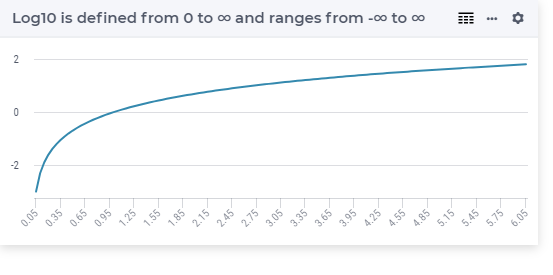

.. aimms:function:: Log10(x)

.. _Log10:

Log10
=====

.. code-block:: aimms

    Log10(
         x             ! (input) numerical expression
         )

Arguments
---------

    *x*
        A scalar numerical expression in the range :math:`(0,\infty)`.

Return Value
------------

    The function :aimms:func:`Log10` returns the base-10 logarithm of :math:`x`.

Graph
-----------------

Example
-----------

.. code-block:: aimms

    p_return := Log(10);
    ! Result is 1 

.. note::

    -  A run-time error results if *x* is outside the range
       :math:`(0,\infty)`.

    -  The function :aimms:func:`Log10` can be used in constraints of nonlinear
       mathematical programs.

.. seealso::

    - The functions :aimms:func:`Exp`, :aimms:func:`Log`. 
    - Arithmetic functions are discussed in full detail in :ref:`sec:expr.num.functions` of the `Language Reference <https://documentation.aimms.com/language-reference/index.html>`__.
