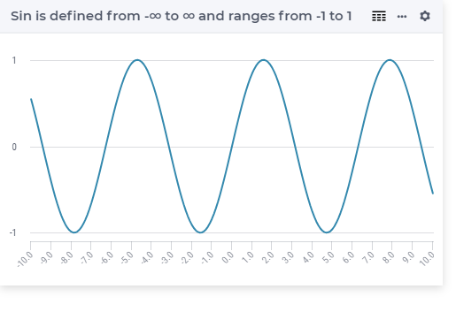

.. aimms:function:: Sin(x)

.. _Sin:

Sin
===

.. code-block:: aimms

    Sin(
       x             ! (input) numerical expression
       )

Arguments
---------

    *x*
        A scalar numerical expression in radians.

Return Value
------------

    The :aimms:func:`Sin` function returns the sine of *x* in the range :math:`-1` to 1.

Graph
-----------------

Example
-----------

.. code-block:: aimms

    _p_returnM1 := Sin(-p_pi); ! Sin(-pi) = 0
    _p_returnZ  := Sin( 0   ); ! Sin( 0 ) = 0
    _p_returnP1 := Sin( p_pi); ! Sin( pi) = 0

.. note::

    The function :aimms:func:`Sin` can be used in constraints of nonlinear
    mathematical programs.

.. seealso::

    -   The functions :aimms:func:`Cos`, :aimms:func:`Tan`, :aimms:func:`ArcSin`. Arithmetic functions are
        discussed in full detail in :ref:`sec:expr.num.functions` of the `Language Reference <https://documentation.aimms.com/language-reference/index.html>`__.

    -   `Wikipedia <https://en.wikipedia.org/wiki/Sine_and_cosine>`_