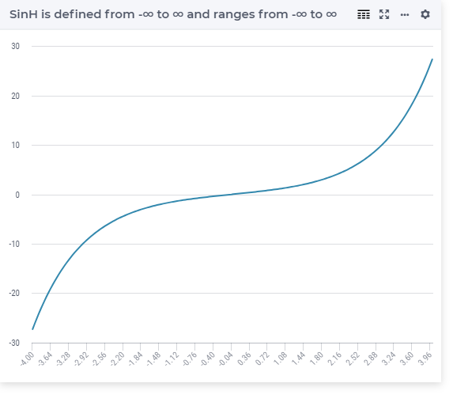

.. aimms:function:: Sinh(x)

.. _Sinh:

Sinh
====

.. code-block:: aimms

    Sinh(
        x             ! (input) numerical expression
        )

Arguments
---------

    *x*
        A scalar numerical expression.

Return Value
------------

    The :aimms:func:`Sinh` function returns the hyperbolic sine of *x* in the range
    :math:`-\infty` to :math:`\infty`.

Graph
-----------------

Example
-----------

.. code-block:: aimms

    _p_returnA := SinH( 0    ); ! SinH( 0   ) = 0
    _p_returnB := SinH( 1    ); ! SinH( 1   ) = 1.175201193644
    _p_returnC := SinH( p_pi ); ! SinH( pi  ) = 11.548739357258
    _p_returnD := SinH( 10   ); ! SinH( 1e3 ) = 11013.232874703393

.. note::

    The function :aimms:func:`Sinh` can be used in the constraints of nonlinear
    mathematical programs.

.. seealso::

    -   The functions :aimms:func:`Cosh`, :aimms:func:`Tanh`, :aimms:func:`ArcSinh`. 
    -   Arithmetic functions are discussed in full detail in :ref:`sec:expr.num.functions` of the `Language Reference <https://documentation.aimms.com/language-reference/index.html>`__.
