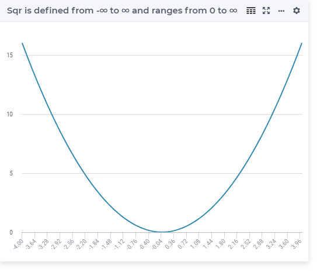

.. aimms:function:: Sqr(x)

.. _Sqr:

Sqr
===

.. code-block:: aimms

    Sqr(
        x             ! (input) numerical expression
        )

Arguments
---------

    *x*
        A scalar numerical expression.

Return Value
------------

    The function :aimms:func:`Sqr` returns :math:`x^2`.

Graph
-----------------

Example
-----------

.. code-block:: aimms

    _p_returnA := Sqr( 0    ); ! Sqr(  0 ) = 0
    _p_returnB := Sqr( 1    ); ! Sqr(  1 ) = 1 
    _p_returnC := Sqr( p_pi ); ! Sqr( pi ) = 9.869604401089
    _p_returnD := Sqr( 10   ); ! Sqr( 10 ) = 100

.. note::

    The function :aimms:func:`Sqr` can be used in constraints of nonlinear
    mathematical programs.

.. seealso::

    -   The functions :aimms:func:`Power`, :aimms:func:`Cube`, and :aimms:func:`Sqrt`. 
    -   Arithmetic functions are discussed in full detail in :ref:`sec:expr.num.functions` of the `Language Reference <https://documentation.aimms.com/language-reference/index.html>`__.
