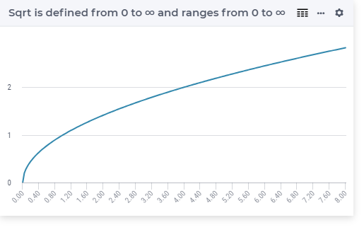

.. aimms:function:: Sqrt(x)

.. _Sqrt:

Sqrt
====

.. code-block:: aimms

    Sqrt(
        x             ! (input) numerical expression
        )

Arguments
---------

    *x*
        A scalar numerical expression in the range :math:`[0,\infty)`.

Return Value
------------

    The function :aimms:func:`Sqrt` returns the :math:`\sqrt{x}`.

Graph
-----------------

Example
-----------

.. code-block:: aimms

    _p_returnA := Sqrt( 0    ); ! Sqrt(  0 ) = 0
    _p_returnB := Sqrt( 1    ); ! Sqrt(  1 ) = 1 
    _p_returnC := Sqrt( p_pi ); ! Sqrt( pi ) = 1.772453850906
    _p_returnD := Sqrt( 10   ); ! Sqrt( 10 ) = 3.162277660168

.. note::

    -  A run-time error results if *x* is outside the range
       :math:`[0,\infty)`.

    -  The function :aimms:func:`Sqrt` can be used in the constraints of nonlinear
       mathematical programs.

.. seealso::

    -   The functions :aimms:func:`Power`, :aimms:func:`Cube`, and :aimms:func:`Sqr`. 
    -   Arithmetic functions are discussed in full detail in :ref:`sec:expr.num.functions` of the `Language Reference <https://documentation.aimms.com/language-reference/index.html>`__.
    -   `Square Root (Wikipedia) <https://en.wikipedia.org/wiki/Square_root>`_.