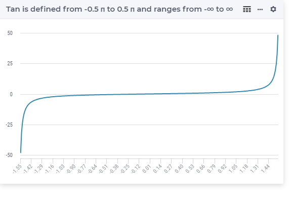

.. aimms:function:: Tan(x)

.. _Tan:

Tan
===

.. code-block:: aimms

    Tan(
       x             ! (input) numerical expression
       )

Arguments
---------

    *x*
        A scalar numerical expression in radians.

Return Value
------------

    The :aimms:func:`Tan` function returns the tangent of *x* in the range
    :math:`-\infty` to :math:`\infty`.

Graph
-----------------

Example
-----------

.. code-block:: aimms

    _p_returnM1 := Tan(-1.56); ! Tan(-1.56) = -92.620496316705
    _p_returnZ  := Tan( 0   ); ! Tan( 0) = 0
    _p_returnP1 := Tan( 1.56); ! Tan( 1.56) = 92.620496316705

.. note::

    The function :aimms:func:`Tan` can be used in constraints of nonlinear
    mathematical programs.

.. seealso::

    -   The functions :aimms:func:`Cos`, :aimms:func:`Sin`, :aimms:func:`ArcTan`. Arithmetic functions are
        discussed in full detail in :ref:`sec:expr.num.functions` of the `Language Reference <https://documentation.aimms.com/language-reference/index.html>`__.

    -   `Wikipedia <https://en.wikipedia.org/wiki/Sine_and_cosine>`_