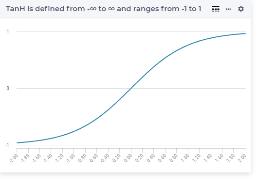

.. aimms:function:: Tanh(x)

.. _Tanh:

Tanh
====

.. code-block:: aimms

    Tanh(
        x             ! (input) numerical expression
        )

Arguments
---------

    *x*
        A scalar numerical expression.

Return Value
------------

    The :aimms:func:`Tanh` function returns the hyperbolic tangent of *x* in the range
    :math:`-1` to :math:`1`.

 

Graph
-----------------

Example
-----------

.. code-block:: aimms

    _p_returnA := TanH( 0    ); ! TanH( 0   ) = 0
    _p_returnB := TanH( 1    ); ! TanH( 1   ) = 0.761594155956
    _p_returnC := TanH( p_pi ); ! TanH( pi  ) = 0.996272076221
    _p_returnD := TanH( 1e9  ); ! TanH( 1e3 ) = 1 

.. note::

    The function :aimms:func:`Tanh` can be used in constraints of nonlinear
    mathematical programs.

.. seealso::

    -   The functions :aimms:func:`Cosh`, :aimms:func:`Sinh`, :aimms:func:`ArcTanh`. Arithmetic functions are
        discussed in full detail in :ref:`sec:expr.num.functions` of the `Language Reference <https://documentation.aimms.com/language-reference/index.html>`__.

    -   `Wikipedia <https://en.wikipedia.org/wiki/Hyperbolic_functions>`_