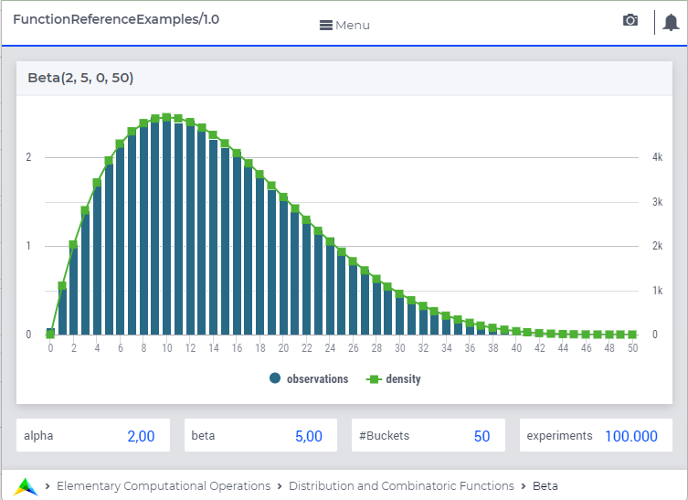

.. aimms:function:: Beta(ShapeAlpha, ShapeBeta, Minimum, Maximum)

.. _Beta:

Beta
====

The function :aimms:func:`Beta` draws a random value from a beta distribution.

.. code-block:: aimms

    Beta(
        ShapeAlpha,            ! (input) numerical expression
        ShapeBeta,             ! (input) numerical expression
        Minimum,               ! (optional) numerical expression
        Maximum                ! (optional) numerical expression
        )

Arguments
---------

    *ShapeAlpha*
        A scalar numerical expression :math:`> 0`.

    *ShapeBeta*
        A scalar numerical expression :math:`> 0`.

    *Minimum*
        A scalar numerical expression.

    *Maximum*
        A scalar numerical expression :math:`>`\ *min*.

Return Value
------------

    The function :aimms:func:`Beta` returns a random value drawn from a beta
    distribution with shapes *ShapeAlpha*, *ShapeBeta*, lower bound
    *Minimum* and upper bound *Maximum*.

.. note::

    The prototype of this function has changed with the introduction of
    AIMMS 3.4. In order to run models that still use the original prototype,
    the option ``Distribution_compatibility`` should be set to
    ``Aimms_3_0``. The original function :aimms:func:`Beta`\ (*ShapeAlpha*,
    *ShapeBeta*, *s*) returns a random value drawn from a beta distribution
    with shapes *ShapeAlpha*, *ShapeBeta* and scale *s*, where
    :math:`s = Maximum` and :math:`Minimum = 0`.

Graph
-----------------

A graph with:
 
*   a histogram for 100.000 experiments of drawing from distribution ``beta(2,5,0,50)``, and

*   the :aimms:func:`DistributionDensity` for ``beta(2,5,0,50)``

Example
--------

The code:

.. code-block:: aimms

	option seed := 1234 ;
	_p_draw := Beta( 2, 5 )  ;
	_p_pointDensity := DistributionDensity( Beta( 2, 5 ), 0.5 );

	block where listing_number_precision := 6 ;
		display _p_draw, _p_pointDensity ;
	endblock ;

will produce

.. code-block:: aimms

    _p_draw := 0.510666 ;
    _p_pointDensity := 0.937500 ;

in the listing file.

References
-----------

    *   The :aimms:func:`Beta` distribution is discussed in full detail in   
	    :doc:`appendices/distributions-statistical-operators-and-histogram-functions/continuous-distributions` of
		the `Language Reference <https://documentation.aimms.com/language-reference/index.html>`__.

    *   `Wikipedia <https://en.wikipedia.org/wiki/Beta_distribution>`_