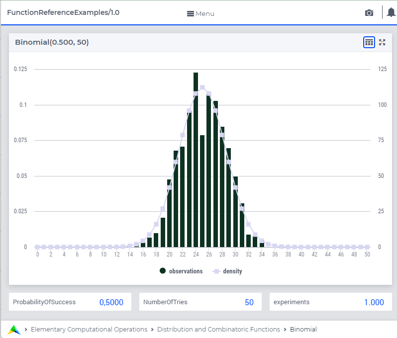

.. aimms:function:: Binomial(ProbabilityOfSuccess, NumberOfTries)

.. _Binomial:

Binomial
========

The function :aimms:func:`Binomial` draws a random value from a binomial
distribution.

.. code-block:: aimms

    Binomial(
            ProbabilityOfSuccess, ! (input) numerical expression
            NumberOfTries         ! (input) integer expression
            )

Arguments
---------

    *ProbabilityOfSuccess*
        A scalar numerical expression in range :math:`(0,1)`.

    *NumberOfTries*
        An integer numerical expression :math:`> 0`.

Return Value
------------

    The function :aimms:func:`Binomial` returns a random value drawn from a binomial
    distribution with a probability of success *ProbabilityOfSuccess* and
    number of tries *NumberOfTries*

		
Graph
-----------------

A graph with:
 
*   a histogram for 1000 experiments of drawing from distribution ``Binomial(0.5,50)``, and

*   the :aimms:func:`DistributionDensity` for ``Binomial(0.5,50)``

Example
-----------

The code:

.. code-block:: aimms

	option seed := 1234 ;
	_p_draw := Binomial( 0.7, 50 );
	_p_pointDensity := DistributionDensity( Binomial( 0.7, 50 ), 25 );

	block where listing_number_precision := 6 ;
		display _p_draw, _p_pointDensity ;
	endblock ;

will produce

.. code-block:: aimms

    _p_draw := 37 ;
    _p_pointDensity := 0.001436 ;

in the listing file.

References
-----------

    *   The :aimms:func:`Binomial` distribution is discussed in full detail in
        :doc:`appendices/distributions-statistical-operators-and-histogram-functions/discrete-distributions`
        of the `Language Reference <https://documentation.aimms.com/language-reference/index.html>`__.
		
    *   `Wikipedia <https://en.wikipedia.org/wiki/Binomial_distribution>`_