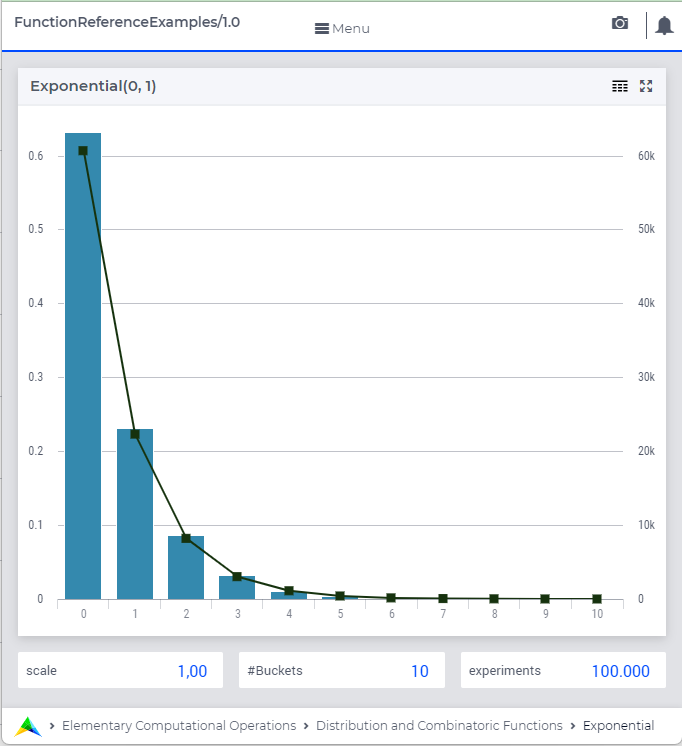

.. aimms:function:: Exponential(lowerbound, scale)

.. _Exponential:

Exponential
===========

The function :aimms:func:`Exponential` draws a random value from an exponential
distribution.

.. code-block:: aimms

    Exponential(
          lowerbound      ! (optional) numerical expression
          scale           ! (optional) numerical expression
         )

Arguments
---------

    *lowerbound*
        A scalar numerical expression.

    *scale*
        A scalar numerical expression :math:`> 0`.

Return Value
------------

    The function :aimms:func:`Exponential` returns a random value drawn from a
    exponential distribution with lower bound *lowerbound* and scale
    *scale*.

.. note::

    The prototype of this function has changed with the introduction of
    AIMMS 3.4. In order to run models that still use the original prototype,
    the option ``Distribution_compatibility`` should be set to
    ``Aimms_3_0``. The original function :aimms:func:`Exponential`\ (*lambda*) returns
    a random value drawn from a exponential distribution with rate
    :math:`lambda = 1/scale` and lower bound :math:`0`.

Graph
-----------------

A graph with:
 
*   a histogram for 100.000 experiments of drawing from distribution ``Exponential(0,1)``, and

*   the :aimms:func:`DistributionDensity` for ``Exponential(0,1)``

Example
--------

The code:

.. code-block:: aimms

	option seed := 1234 ;
	_p_draw := Exponential( 0, 10 )  ;
	_p_pointDensity := DistributionDensity( Exponential( 0, 10 ), 3 );

	block where listing_number_precision := 6 ;
		display _p_draw, _p_pointDensity ;
	endblock ;

will produce

.. code-block:: aimms

    _p_draw := 4.948559 ;
    _p_pointDensity := 7.408182 ;

in the listing file.

References
-----------

    *   The :aimms:func:`Exponential` distribution is discussed in full detail in 
        :doc:`appendices/distributions-statistical-operators-and-histogram-functions/continuous-distributions`
        of the `Language Reference <https://documentation.aimms.com/language-reference/index.html>`__.

    *   `Wikipedia <https://en.wikipedia.org/wiki/Exponential_distribution>`_

