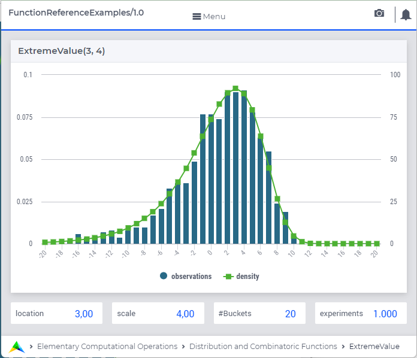

.. aimms:function:: ExtremeValue(location, scale)

.. _ExtremeValue:

ExtremeValue
============

The function :aimms:func:`ExtremeValue` draws a random value from an extreme value
distribution.

.. code-block:: aimms

    ExtremeValue(
           location,    ! (optional) numerical expression
           scale        ! (optional) numerical expression
           )

The ``ExtremeValue(location,scale)`` distribution provided by AIMMS is a 
Type I ``Gumbel`` (:math:`\mu`, :math:`\beta`) distribution.

Arguments
---------

    *location*
        A scalar numerical expression.

    *scale*
        A scalar numerical expression :math:`> 0`.

Return Value
------------

    The function :aimms:func:`ExtremeValue` returns a random value drawn from an
    extreme value distribution with location *location* and scale *scale*.

Graph
-----------------

|

A graph with:
 
*   a histogram for 1.000 experiments of drawing from distribution ``ExtremeValue(3,4)``, and

*   the :aimms:func:`DistributionDensity` for ``ExtremeValue(3,4)``.

Example
--------

The code:

.. code-block:: aimms

	option seed := 1234 ;
	_p_draw := ExtremeValue( 0, 10 )  ;
	_p_pointDensity := DistributionDensity( ExtremeValue( 0, 10 ), 3 );

	block where listing_number_precision := 6 ;
		display _p_draw, _p_pointDensity ;
	endblock ;

will produce

.. code-block:: aimms

    _p_draw := -2.456478 ;
    _p_pointDensity := 0.034999 ;

in the listing file.

.. seealso::

    *   The :aimms:func:`ExtremeValue` distribution is discussed in full detail in :doc:`appendices/distributions-statistical-operators-and-histogram-functions/continuous-distributions` of the `Language Reference <https://documentation.aimms.com/language-reference/index.html>`_.
    *   `Generalized Extreme Value Distribution (Wikipedia) <https://en.wikipedia.org/wiki/Generalized_extreme_value_distribution>`_.
    *   `Gumbel Distribution (Wikipedia) <https://en.wikipedia.org/wiki/Gumbel_distribution>`_.
