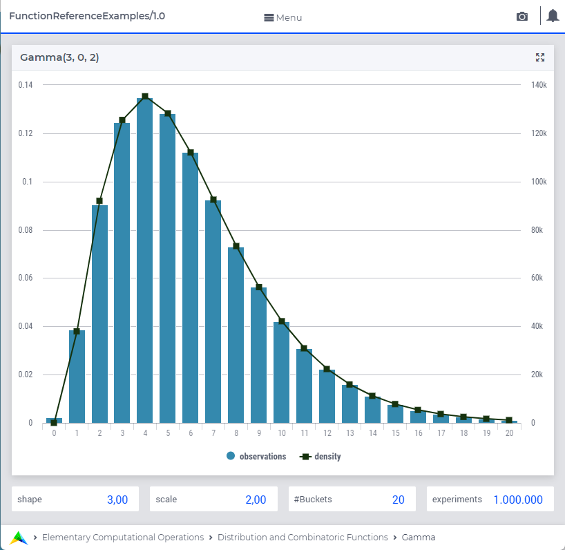

.. aimms:function:: Gamma(Shape, Lowerbound, Scale)

.. _Gamma:

Gamma
=====

The function :aimms:func:`Gamma` draws a random value from a gamma distribution.

.. code-block:: aimms

    Gamma(
         Shape,        ! (input) numerical expression
         Lowerbound,   ! (optional) numerical expression
         Scale         ! (optional) numerical expression
         )

Arguments
---------

    *Shape*
        A scalar numerical expression :math:`> 0`.

    *Lowerbound*
        A scalar numerical expression :math:`>= 0`.

    *Scale*
        A scalar numerical expression :math:`> 0`.

Return Value
------------

    The function :aimms:func:`Gamma` returns a random value drawn from a gamma
    distribution with shape *Shape*, lower bound *Lowerbound* and scale
    *Scale*.

.. note::

    The prototype of this function has changed with the introduction of
    AIMMS 3.4. In order to run models that still use the original prototype,
    the option ``Distribution_compatibility`` should be set to
    ``Aimms_3_0``. The original function :aimms:func:`Gamma` (*alpha*, *Shape*)
    returns a random value drawn from a gamma distribution with rate
    :math:`alpha = 1/Scale`, shape *Shape* and lower bound :math:`0`.

Graph
-----------------

|

A graph with:
 
*   a histogram for 1.000.000 experiments of drawing from distribution ``Gamma(3,0,2)``, and

*   the :aimms:func:`DistributionDensity` for ``Gamma(3,0,2)``.

Example
--------

The code:

.. code-block:: aimms

	option seed := 1234 ;
	_p_draw := Gamma( 3, 0, 2 )  ;
	_p_pointDensity := DistributionDensity( Gamma( 3, 0, 2 ), 9 );

	block where listing_number_precision := 6 ;
		display _p_draw, _p_pointDensity ;
	endblock ;

will produce

.. code-block:: aimms

    _p_draw := 11.206294 ;
    _p_pointDensity := 0.056239 ;

in the listing file.

.. seealso::

    *    The :aimms:func:`Gamma` distribution is discussed in full detail in :doc:`appendices/distributions-statistical-operators-and-histogram-functions/continuous-distributions` of the `Language Reference <https://documentation.aimms.com/language-reference/index.html>`_.
    *   `Gamma Distribution (Wikipedia) <https://en.wikipedia.org/wiki/Gamma_distribution>`_.

