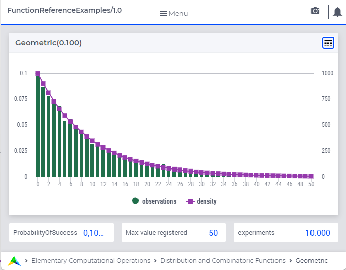

.. aimms:function:: Geometric(ProbabilityOfSuccess)

.. _Geometric:

Geometric
=========

The function :aimms:func:`Geometric`  
draws a random value from a geometric
distribution.

It represents the number of failures in a series of drawings whereby the chance of success is ``ProbabilityOfSuccess``

.. code-block:: aimms

    Geometric(
       ProbabilityOfSuccess    ! (input) numerical expression
             )

Arguments
---------

    *ProbabilityOfSuccess*
        A scalar numerical expression in the range :math:`(0,1)`.

Return Value
------------

    The function :aimms:func:`Geometric` returns a random value drawn from a geometric
    distribution with a probability of success *ProbabilityOfSuccess*.

        
Graph
-----------------

A graph with:
 
*   a histogram for 10000 experiments of drawing from distribution ``Geometric(0.1)``, and

*   the :aimms:func:`DistributionDensity` for ``Geometric(0.1)``

Example
--------

The code:

.. code-block:: aimms

	option seed := 1234 ;
	_p_draw := Geometric( 0.1 );
	_p_pointDensity := DistributionDensity( Geometric( 0.1 ), 5 );

	block where listing_number_precision := 6 ;
		display _p_draw, _p_pointDensity ;
	endblock ;

will produce

.. code-block:: aimms

    _p_draw := 7 ;
    _p_pointDensity := 0.059049 ;

in the listing file.

Indicates: 

* that for the first drawing: 7 failures before success, when chance of success is 0.1, and

* the probability for result 5 is 0.059049.

References
-----------

    *   The :aimms:func:`Geometric` distribution is discussed in full detail in :doc:`appendices/distributions-statistical-operators-and-histogram-functions/discrete-distributions`
        of the `Language Reference <https://documentation.aimms.com/language-reference/index.html>`__.
        
    *   `Wikipedia <https://en.wikipedia.org/wiki/Geometric_distribution>`_
