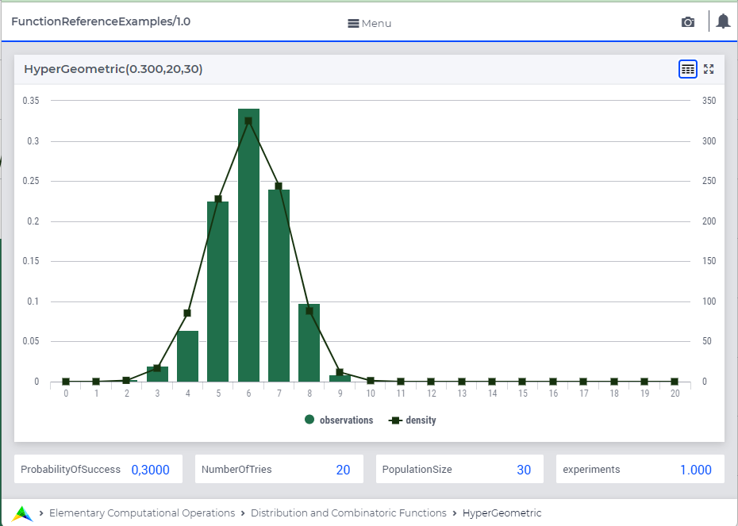

.. aimms:function:: HyperGeometric(ProbabilityOfSuccess, NumberOfTries, PopulationSize)

.. _HyperGeometric:

HyperGeometric
==============

The function :aimms:func:`HyperGeometric` draws a random value from a
hypergeometric distribution.

.. code-block:: aimms

    HyperGeometric(
        ProbabilityOfSuccess,   ! (input) numerical expression
        NumberOfTries,          ! (input) integer expression
        PopulationSize          ! (input) integer expression
                  )

Arguments
---------

    *ProbabilityOfSuccess*
        A scalar numerical expression in the range :math:`(0,1)`.

    *NumberOfTries*
        A integer numerical expression in the range
        :math:`1,\dots,{PopulationSize}`.

    *PopulationSize*
        A integer numerical expression :math:`> 0`.

Return Value
------------

    The function :aimms:func:`HyperGeometric` returns a random value drawn from a
    hypergeometric distribution with a probability of success
    *ProbabilityOfSuccess*, number of tries *NumberOfTries* and population
    size *PopulationSize*.

.. note::

    The probability of success *ProbabilityOfSuccess* must assume one of the
    values :math:`i/{size}`, where :math:`i` is in the range
    :math:`1,\dots,{PopulationSize}-1`.
        
Graph
-----------------

A graph with:
 
*   a histogram for 10000 experiments of drawing from distribution ``HyperGeometric(0.3,20,30)``, and

*   the :aimms:func:`DistributionDensity` for ``HyperGeometric(0.3,20,30)``

Example
--------

The code:

.. code-block:: aimms

	option seed := 1234 ;
	_p_draw := HyperGeometric( 0.4, 20, 50 );
	_p_pointDensity := DistributionDensity( HyperGeometric( 0.4, 20, 50 ), 5 );

	block where listing_number_precision := 6 ;
		display _p_draw, _p_pointDensity ;
	endblock ;

will produce

.. code-block:: aimms

    _p_draw := 8 ;
    _p_pointDensity := 0.051029 ;

in the listing file.

Indicates: 

* that for the first drawing: 8 success, when sampling 20 out of a population of 50 where each individual has propability 0.4 for success

* the probability for result 5 is 0.059049.

References
-----------

    *   The :aimms:func:`HyperGeometric` distribution is discussed in full detail in
        :doc:`appendices/distributions-statistical-operators-and-histogram-functions/discrete-distributions` of the `Language Reference <https://documentation.aimms.com/language-reference/index.html>`__.

    *   `Wikipedia <https://en.wikipedia.org/wiki/Hypergeometric_distribution>`_