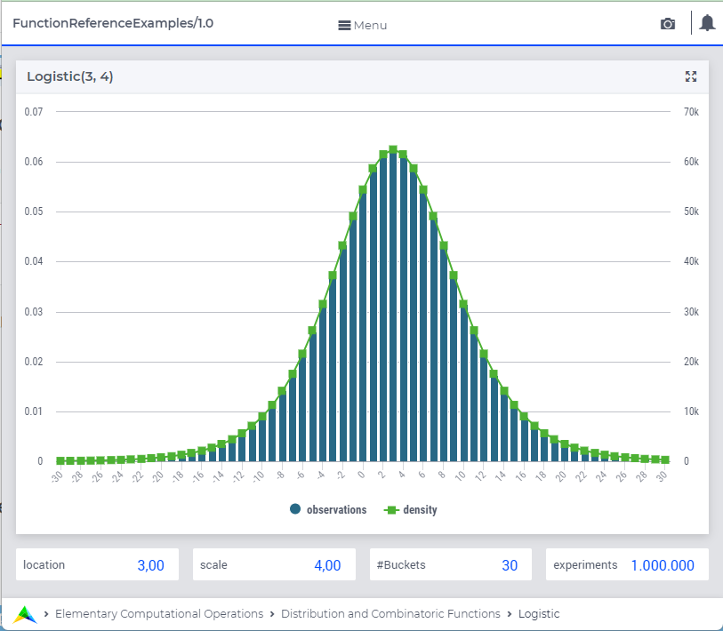

.. aimms:function:: Logistic(Location, Scale)

.. _Logistic:

Logistic
========

The function :aimms:func:`Logistic` draws a random value from a logistic
distribution.

.. code-block:: aimms

    Logistic(
             Location,    ! (optional) numerical expression
             Scale        ! (optional) numerical expression
             )

Arguments
---------

    *Location*
        A scalar numerical expression.

    *Scale*
        A scalar numerical expression :math:`> 0`.

Return Value
------------

    The function :aimms:func:`Logistic` returns a random value drawn from a logistic
    distribution with mean *Location* and scale *Scale*.

Graph
-----------------

|

A graph with:
 
*   a histogram for 1.000.000 experiments of drawing from distribution ``Logistic(3,4)``, and

*   the :aimms:func:`DistributionDensity` for ``Logistic(3,4)``.

Example
--------

The code:

.. code-block:: aimms

	option seed := 1234 ;
	_p_draw := Logistic( 0, 10 )  ;
	_p_pointDensity := DistributionDensity( Logistic( 0, 10 ), 3 );

	block where listing_number_precision := 6 ;
		display _p_draw, _p_pointDensity ;
	endblock ;

will produce

.. code-block:: aimms

    _p_draw := -21.717284 ;
    _p_pointDensity := 0.024446 ;

in the listing file.

.. seealso::

    *   The :aimms:func:`Logistic` distribution is discussed in full detail in :doc:`appendices/distributions-statistical-operators-and-histogram-functions/continuous-distributions` of the `Language Reference <https://documentation.aimms.com/language-reference/index.html>`_.
    *   `Gamma Distribution (Wikipedia) <https://en.wikipedia.org/wiki/Gamma_distribution>`_.
