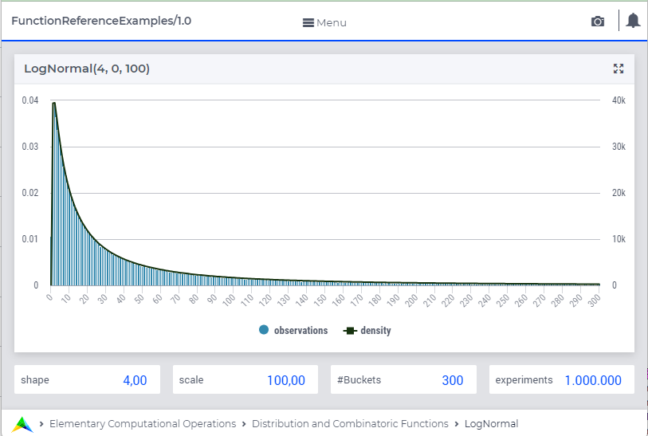

.. aimms:function:: LogNormal(Shape, Lowerbound, Scale)

.. _LogNormal:

LogNormal
=========

The function :aimms:func:`LogNormal` draws a random value from a lognormal
distribution.

.. code-block:: aimms

    LogNormal(
        Shape,        ! (input) numerical expression
        Lowerbound,   ! (optional) numerical expression
        Scale         ! (optional) numerical expression
        )

Arguments
---------

    *Shape*
        A scalar numerical expression :math:`> 0`.

    *Lowerbound*
        A scalar numerical expression.

    *Scale*
        A scalar numerical expression :math:`> 0`.

Return Value
------------

    The function :aimms:func:`LogNormal` returns a random value drawn from a lognormal
    distribution with shape *Shape*, lower bound *Lowerbound* and scale
    *Scale*.

.. note::

    The prototype of this function has changed with the introduction of
    AIMMS 3.4. In order to run models that still use the original prototype,
    the option ``Distribution_compatibility`` should be set to
    ``Aimms_3_0``. The original function :aimms:func:`LogNormal` (*m*, *sd*) returns
    a random value drawn from a lognormal distribution with mean :math:`m>0`
    and standard deviation :math:`sd>0`. The same result should now be
    obtained by setting :math:`Shape = sd/m`, :math:`Lowerbound=0` and
    :math:`Scale = m`.

Graph
-----------------

|

A graph with:
 
*   a histogram for 1.000.000 experiments of drawing from distribution ``LogNormal(4,0,100)``, and

*   the :aimms:func:`DistributionDensity` for ``LogNormal(4,0,100)``.

Example
--------

The code:

.. code-block:: aimms

	option seed := 1234 ;
	_p_draw := LogNormal( 4, 0, 1 )  ;
	_p_pointDensity := DistributionDensity( LogNormal( 4, 0, 1 ), 3 );

	block where listing_number_precision := 6 ;
		display _p_draw, _p_pointDensity ;
	endblock ;

will produce

.. code-block:: aimms

    _p_draw := 0.042849 ;
    _p_pointDensity := 0.025869 ;

in the listing file.

.. seealso::

    *   The :aimms:func:`LogNormal` distribution is discussed in full detail in :doc:`appendices/distributions-statistical-operators-and-histogram-functions/continuous-distributions` of the `Language Reference <https://documentation.aimms.com/language-reference/index.html>`_.
    *   `Wikipedia <https://en.wikipedia.org/wiki/Log-normal_distribution>`_.
