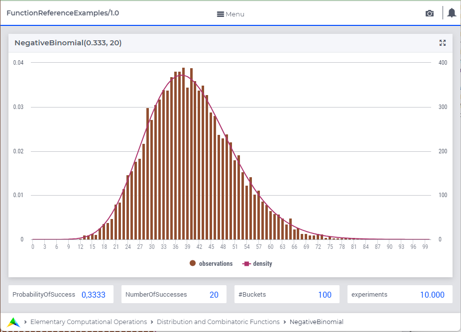

.. aimms:function:: NegativeBinomial(ProbabilityOfSuccess, NumberOfSuccesses)

.. _NegativeBinomial:

NegativeBinomial
================

The function :aimms:func:`NegativeBinomial` draws a random value from a negative
binomial distribution.

.. code-block:: aimms

    NegativeBinomial(
        ProbabilityOfSuccess,   ! (input) numerical expression
        NumberOfSuccesses       ! (input) integer expression
        )

This value represents the number of failures until ``NumberOfSuccesses`` 
were achieved, whereby each trial has a chance of ``ProbabilityOfSuccess`` 
to succeed.

Arguments
---------

    *ProbabilityOfSuccess*
        A scalar numerical expression in the range :math:`(0,1)`.

    *NumberOfSuccesses*
        An integer numerical expression :math:`> 0`.

Return Value
------------

    The function :aimms:func:`NegativeBinomial` returns a random value drawn from a
    negative binomial distribution with probability *ProbabilityOfSuccess*
    and number of successes *NumberOfSuccesses*. 

Graph
-----------------

A graph with:
 
*   a histogram for 10.000 experiments of drawing from distribution ``NegativeBinomial(0.3333,20)``, and

*   the :aimms:func:`DistributionDensity` for ``NegativeBinomial(0.3333,20)``

Example
--------

The code:

.. code-block:: aimms

	option seed := 1234 ;
	_p_draw := NegativeBinomial( 0.7, 50 );
	_p_pointDensity := DistributionDensity( NegativeBinomial( 0.7, 50 ), 25 );

	block where listing_number_precision := 6 ;
		display _p_draw, _p_pointDensity ;
	endblock ;

will produce

.. code-block:: aimms

    _p_draw := 31 ;
    _p_pointDensity := 0.053424 ;

in the listing file.

References
-----------

    *   The :aimms:func:`NegativeBinomial` distribution is discussed in full detail in
        :doc:`appendices/distributions-statistical-operators-and-histogram-functions/discrete-distributions` 
        of the `Language Reference <https://documentation.aimms.com/language-reference/index.html>`__.

    *   `Wikipedia <https://en.wikipedia.org/wiki/Negative_binomial_distribution>`_