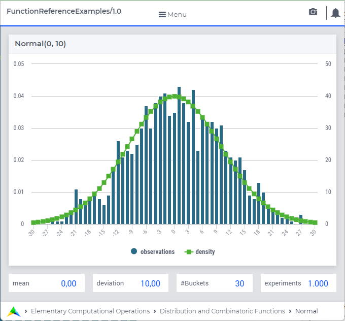

.. aimms:function:: Normal(Mean, Deviation)

.. _Normal:

Normal
======

The function :aimms:func:`Normal` draws a random value from a normal distribution.

.. code-block:: aimms

    Normal(
        Mean,       ! (optional) numerical expression
        Deviation   ! (optional) numerical expression
        )

Arguments
---------

    *Mean*
        A scalar numerical expression.

    *Deviation*
        A scalar numerical expression :math:`> 0`.

Return Value
------------

    The function :aimms:func:`Normal` returns a random value drawn from a normal
    distribution with mean *Mean* and standard deviation *Deviation*.

Graph
-----------------

A graph with:
 
*   a histogram for 1.000 experiments of drawing from distribution ``Normal(0,10)``, and

*   the :aimms:func:`DistributionDensity` for ``Normal(0,10)``

Example
--------

The code:

.. code-block:: aimms

	option seed := 1234 ;
	_p_draw := Normal( 0, 10 )  ;
	_p_pointDensity := DistributionDensity( Normal( 0, 10 ), 3 );

	block where listing_number_precision := 6 ;
		display _p_draw, _p_pointDensity ;
	endblock ;

will produce

.. code-block:: aimms

    _p_draw := 6.124772 ;
    _p_pointDensity := 0.038139 ;

in the listing file.

References
-----------

    *   The :aimms:func:`Normal` distribution is discussed in full detail in
        :doc:`appendices/distributions-statistical-operators-and-histogram-functions/continuous-distributions` of
        the `Language Reference <https://documentation.aimms.com/language-reference/index.html>`__.

    *   `Wikipedia <https://en.wikipedia.org/wiki/Normal_distribution>`_

