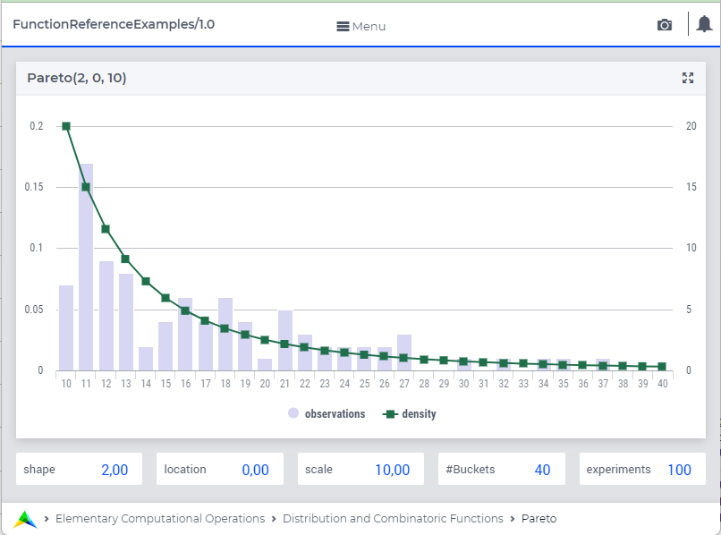

.. aimms:function:: Pareto(Shape, Location, Scale)

.. _Pareto:

Pareto
======

The function :aimms:func:`Pareto` draws a random value from a Pareto distribution.

.. code-block:: aimms

    Pareto(
          Shape,           ! (input) numerical expression
          Location,        ! (optional) numerical expression
          Scale            ! (optional) numerical expression
          )

Arguments
---------

    *Shape*
        A scalar numerical expression :math:`> 0`.

    *Location*
        A scalar numerical expression.

    *Scale*
        A scalar numerical expression :math:`> 0`.

Return Value
------------

    The function :aimms:func:`Pareto` returns a random value drawn from a Pareto
    distribution with shape *Shape*, location *Location* and scale *Scale*.

.. note::

    The prototype of this function has changed with the introduction of
    AIMMS 3.4. In order to run models that still use the original prototype,
    the option ``Distribution_compatibility`` should be set to
    ``Aimms_3_0``. The original function :aimms:func:`Pareto`\ (*s*, *beta*) returns a
    random value drawn from a Pareto distribution with shape *beta*,
    location :math:`0` and scale *s*.

Graph
-----------------

|

A graph with:
 
*   a histogram for 100 experiments of drawing from distribution ``Pareto(2,0,10)``, and

*   the :aimms:func:`DistributionDensity` for ``Pareto(2,0,10)``.

Example
--------

The code:

.. code-block:: aimms

	option seed := 1234 ;
	_p_draw := Pareto( 2, 0, 1 )  ;
	_p_pointDensity := DistributionDensity( Pareto( 2, 0, 1 ), 2 );

	block where listing_number_precision := 6 ;
		display _p_draw, _p_pointDensity ;
	endblock ;

will produce

.. code-block:: aimms

    _p_draw := 1.262422 ;
    _p_pointDensity := 0.250000 ;

in the listing file.

.. seealso::

    *   The :aimms:func:`Pareto` distribution is discussed in full detail in :doc:`appendices/distributions-statistical-operators-and-histogram-functions/continuous-distributions` of the `Language Reference <https://documentation.aimms.com/language-reference/index.html>`_.
    *   `Pareto Distribution (Wikipedia) <https://en.wikipedia.org/wiki/Pareto_distribution>`_.

