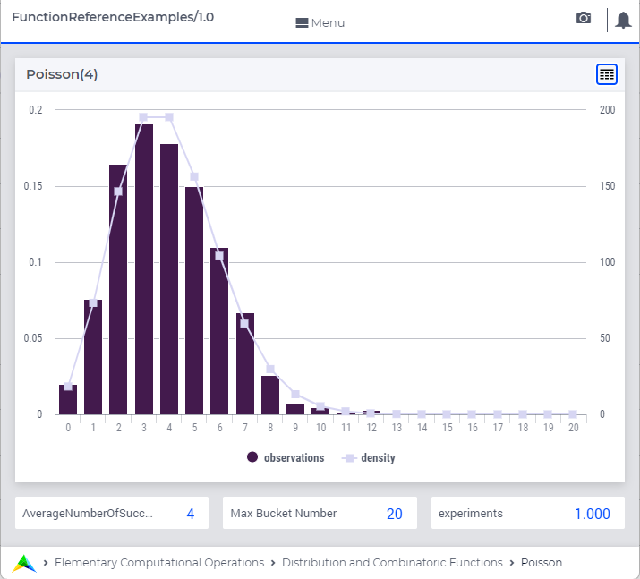

.. aimms:function:: Poisson(lambda)

.. _Poisson:

Poisson
=======

The function :aimms:func:`Poisson` draws a random value from a Poisson
distribution.

.. code-block:: aimms

    Poisson(
        AverageNumberOfSuccesses     ! (input) numerical expression
        )

Arguments
---------

    *lambda*
        A scalar numerical expression :math:`> 0`.

Return Value
------------

    The function :aimms:func:`Poisson` returns a random value drawn from a Poisson
    distribution with average number of occurrences
    *AverageNumberOfSuccesses*.

Graph
-----------------

A graph with:
 
*   a histogram for 1000 experiments of drawing from distribution ``Poisson(4)``, and

*   the :aimms:func:`DistributionDensity` for ``Poisson(4)``

Example
--------

The code:

.. code-block:: aimms

	option seed := 1234 ;
	_p_draw := Poisson( 10 );
	_p_pointDensity := DistributionDensity( Poisson( 10 ), 5 );

	block where listing_number_precision := 6 ;
		display _p_draw, _p_pointDensity ;
	endblock ;

will produce

.. code-block:: aimms

    _p_draw := 12 ;
    _p_pointDensity := 0.037833 ;

in the listing file.

References
-----------

    *   The :aimms:func:`Poisson` distribution is discussed in full detail in :doc:`appendices/distributions-statistical-operators-and-histogram-functions/discrete-distributions`
        of the `Language Reference <https://documentation.aimms.com/language-reference/index.html>`__.

    *   `Wikipedia <https://en.wikipedia.org/wiki/Poisson_distribution>`_