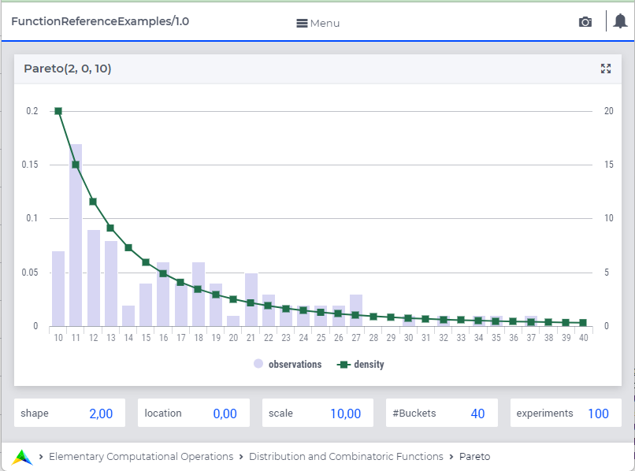

.. aimms:function:: Triangular(Shape, Minimum, Maximum)

.. _Triangular:

Triangular
==========

The function :aimms:func:`Triangular` draws a random value from a triangular
distribution.

.. code-block:: aimms

    Triangular(
         Shape,        ! (input) numerical expression
         Minimum,      ! (optional) numerical expression
         Maximum       ! (optional) numerical expression
         )

Arguments
---------

    *Shape*
        A scalar numerical expression.

    *Minimum*
        A scalar numerical expression.

    *Maximum*
        A scalar numerical expression.

Return Value
------------

    The function :aimms:func:`Triangular` returns a random value drawn from a
    triangular distribution with shape *Shape*, lower bound *Minimum* and
    upper bound *Maximum*. The argument *Shape* must satisfy the relation
    :math:`0 < Shape < 1`.

.. note::

    The prototype of this function has changed with the introduction of
    AIMMS 3.4. In order to run models that still use the original prototype,
    the option ``Distribution_compatibility`` should be set to
    ``Aimms_3_0``. The original function :aimms:func:`Triangular` (*a*, *b*, *c*)
    returns a random value drawn from a triangular distribution with a lower
    bound *a*, likeliest value *b* and upper bound *c*. The arguments must
    satisfy the relation :math:`a < b < c`. The relation between the
    arguments *Shape* and *b* is given by :math:`Shape = (b - a)/(c - a)`.

Graph
-----------------

|

A graph with:
 
*   a histogram for 100 experiments of drawing from distribution ``Triangular(0.300,0,100)``, and

*   the :aimms:func:`DistributionDensity` for ``Triangular(0.300,0,100)``.

Example
--------

The code:

.. code-block:: aimms

    option seed := 1234 ;
    _p_draw := Triangular( 0.3, 0, 100 )  ;
    _p_pointDensity := DistributionDensity( Triangular( 0.3, 0, 100  ), 20 );

    block where listing_number_precision := 6 ;
        display _p_draw, _p_pointDensity ;
    endblock ;

will produce

.. code-block:: aimms

    _p_draw := 40.585179 ;
    _p_pointDensity := 0.013333 ;

in the listing file.

.. seealso::

    *   The :aimms:func:`Triangular` distribution is discussed in full detail in :doc:`appendices/distributions-statistical-operators-and-histogram-functions/continuous-distributions` of the `Language Reference <https://documentation.aimms.com/language-reference/index.html>`_.
    *   `Triangular Distribution (Wikipedia) <https://en.wikipedia.org/wiki/Triangular_distribution>`_.
