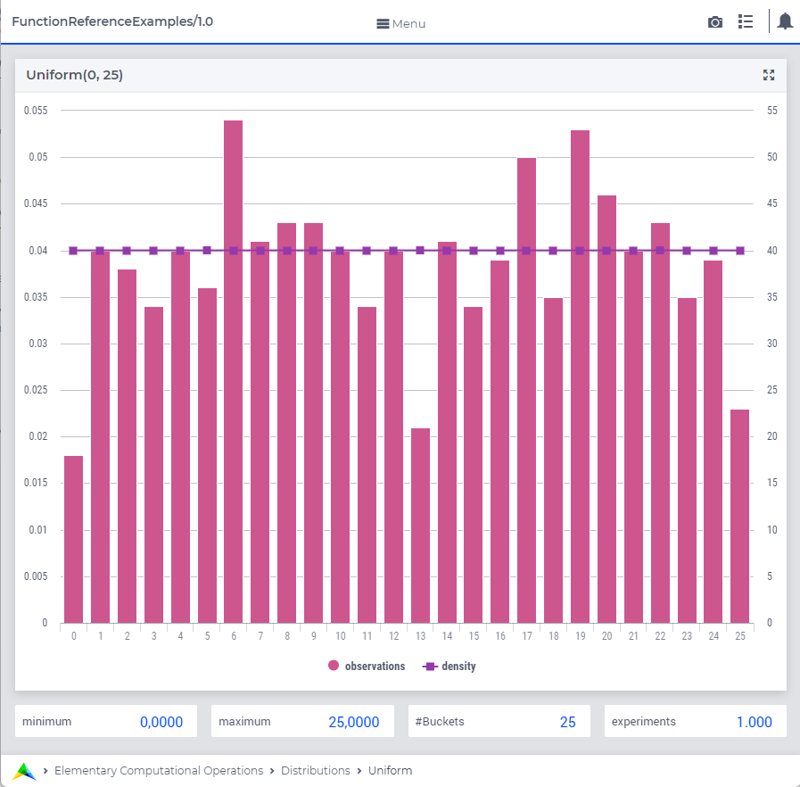

.. aimms:function:: Uniform(Minimum, Maximum)

.. _Uniform:

Uniform
=======

The function :aimms:func:`Uniform` draws a random value from a uniform
distribution.

.. code-block:: aimms

    Uniform(
        Minimum,         ! (optional) numerical expression
        Maximum          ! (optional) numerical expression
        )

Arguments
---------

    *Minimum*
        A scalar numerical expression.

    *Maximum*
        A scalar numerical expression.

Return Value
------------

    The function :aimms:func:`Uniform` returns a random value drawn from a uniform
    distribution with lower bound *Minimum* and upper bound *Maximum*.

.. note::

    The arguments must satisfy the relation :math:`Minimum < Maximum`.

Graph
-----------------

|

A graph with:
 
*   a histogram for 100 experiments of drawing from distribution ``Uniform(0,25)``, and

*   the :aimms:func:`DistributionDensity` for ``Uniform(0,25)``.

Example
--------

The code:

.. code-block:: aimms

    option seed := 1234 ;
    _p_draw := Uniform( 0, 100 )  ;
    _p_pointDensity := DistributionDensity( Uniform( 0, 100  ), 45 );

    block where listing_number_precision := 6 ;
        display _p_draw, _p_pointDensity ;
    endblock ;

will produce

.. code-block:: aimms

    _p_draw := 69.551654 ;
    _p_pointDensity := 0.010000 ;

in the listing file.

.. seealso::

    *   The :aimms:func:`Uniform` distribution is discussed in full detail in :doc:`appendices/distributions-statistical-operators-and-histogram-functions/continuous-distributions` of the `Language Reference <https://documentation.aimms.com/language-reference/index.html>`_.
    *   `Uniform Distribution (Wikipedia) <https://en.wikipedia.org/wiki/Uniform_distribution>`_.

