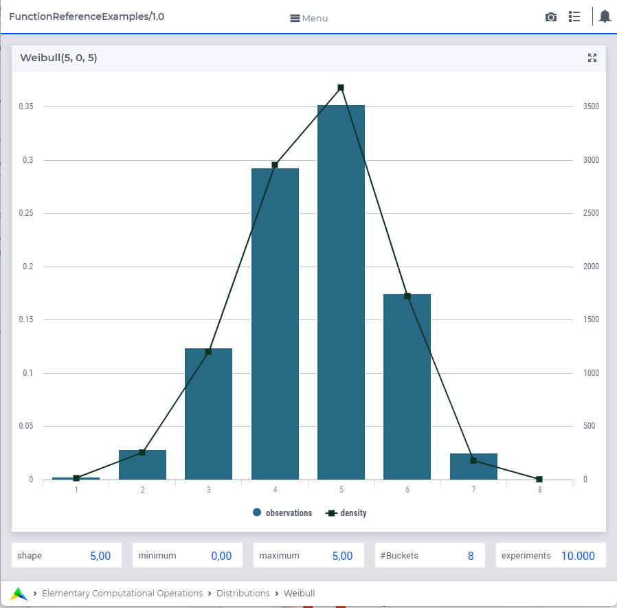

.. aimms:function:: Weibull(Shape, Lowerbound, Scale)

.. _Weibull:

Weibull
=======

The function :aimms:func:`Weibull` draws a random value from a Weibull
distribution.

.. code-block:: aimms

    Weibull(
           Shape,       ! (input) numerical expression
           Lowerbound,  ! (optional) numerical expression
           Scale        ! (optional) numerical expression
           )

Arguments
---------

    *Shape*
        A scalar numerical expression :math:`> 0`.

    *Lowerbound*
        A scalar numerical expression.

    *Scale*
        A scalar numerical expression :math:`> 0`.

Return Value
------------

    The function :aimms:func:`Weibull` returns a random value drawn from a Weibull
    distribution with shape *Shape* lower bound *Lowerbound*, and scale
    *Scale*.

.. note::

    The prototype of this function has changed with the introduction of
    AIMMS 3.4. In order to run models that still use the original prototype,
    the option ``Distribution_compatibility`` should be set to
    ``Aimms_3_0``. In the original function :aimms:func:`Weibull` (*Lowerbound*,
    *Shape*, *Scale*), the arguments were ordered differently.

Graph
-----------------

|

A graph with:
 
*   a histogram for 100 experiments of drawing from distribution ``Weibull(5,0,5)``, and

*   the :aimms:func:`DistributionDensity` for ``Weibull(5,0,5)``.

Example
--------

The code:

.. code-block:: aimms

    option seed := 1234 ;
    _p_draw := Weibull( 0.3, 0, 100 )  ;
    _p_pointDensity := DistributionDensity( Weibull( 0.3, 0, 100  ), 20 );

    block where listing_number_precision := 6 ;
        display _p_draw, _p_pointDensity ;
    endblock ;

will produce

.. code-block:: aimms

    _p_draw := 5.483940 ;
    _p_pointDensity := 0.004994 ;

in the listing file.

.. seealso::

    *   The :aimms:func:`Weibull` distribution is discussed in full detail in :doc:`appendices/distributions-statistical-operators-and-histogram-functions/continuous-distributions` of the `Language Reference <https://documentation.aimms.com/language-reference/index.html>`_.
    *   `Weibull Distribution (Wikipedia) <https://en.wikipedia.org/wiki/Weibull_distribution>`_.

