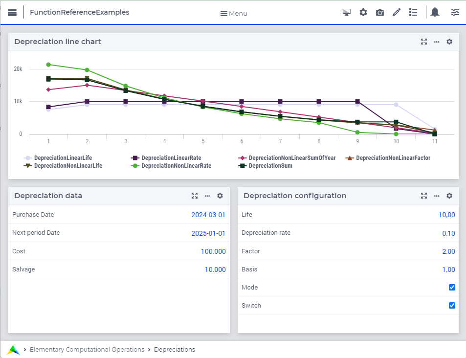

.. _chap:finance-depreciations:

.. _FF.depr:

Depreciations
=============

This chapter discusses the functions available in AIMMS for the
depreciation of an asset. Depreciation can be performed in many ways,
for example by a fixed amount in every period, or by depreciation
amounts that decrease over time. An asset is characterized by its
purchase (or initial) cost :math:`c` and its salvage value :math:`s`
(the value at the end of the useful life of the asset).

Useful Life
^^^^^^^^^^^

The accounting periods for depreciating the asset have a length of one
year, but do not necessarily have to start at January 1. The useful life
of the asset is either given as a fixed amount of :math:`L` years, or is
computed dynamically on the basis of the characteristics of the
depreciation. The first period is the period from the purchase date
until the beginning of the next regular accounting period. If the
purchase date does not coincide with the beginning of an accounting
period, the depreciations take place in :math:`L+1` accounting periods.

.. _FF.depreq:

General Equations
^^^^^^^^^^^^^^^^^

The following system of equations are true for all types of
depreciations supported by AIMMS, where :math:`d_i` is the actual
depreciation in period :math:`i`, :math:`\tilde{d_i}` is the generic
depreciation computed in a method-dependent manner, and :math:`v_i` the
value of the asset at the beginning of period :math:`i`.

.. math::

   \begin{aligned}
       d_i &= \max(0, \min(\tilde{d_i}, v_i - s)) \\
       v_i &= c - \sum_{j=1}^{i-1}d_j\end{aligned}

The equations express that generic method-dependent depreciation method
will be adapted to yield the actual depreciation value to make sure that
the value of an asset :math:`v_i` can never drop below its salvage value
:math:`s`.

Method-Dependent Equations
^^^^^^^^^^^^^^^^^^^^^^^^^^

For each depreciation method available in AIMMS, the equations used to
compute the generic method-dependent depreciation amount
:math:`\tilde{d_i}` will be listed in the description of the
depreciation function. In most occasions these equations use the
fraction :math:`f_{PN}`, which expresses the year fraction from the
purchase date until the beginning of the next regular accounting period.
Its value depends on the selected :ref:`day-count basis<ff.dcb>` method.

AIMMS supports the following linear depreciation by constant amounts
functions:

-  :aimms:func:`DepreciationLinearLife`
-  :aimms:func:`DepreciationLinearRate`

AIMMS supports the following non-linear depreciation by linear declining
amounts functions:

-  :aimms:func:`DepreciationNonLinearSumOfYear`

AIMMS supports the following non-linear depreciation by non-linear
declining amounts functions:

-  :aimms:func:`DepreciationNonLinearLife`
-  :aimms:func:`DepreciationNonLinearFactor`
-  :aimms:func:`DepreciationNonLinearRate`
-  :aimms:func:`DepreciationSum`

.. toctree::
   :hidden:
   
   depreciationlinearlife
   depreciationlinearrate
   depreciationnonlinearsumofyear
   depreciationnonlinearfactor
   depreciationnonlinearlife
   depreciationnonlinearrate
   depreciationsum

