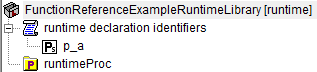

.. aimms:function:: me::ChangeType(runtimeId, newType)

.. _me::ChangeType:

me::ChangeType
==============

The procedure :aimms:func:`me::ChangeType` changes the type of a runtime
identifier.

.. code-block:: aimms

    me::ChangeType(
            runtimeId,  ! (input) an element
            newType     ! (input) an element
    )

Arguments
---------

    *runtimeId*
        An element in the set :aimms:set:`AllIdentifiers` referencing a runtime identifier.

    *newType*
        An element in the set :aimms:set:`AllIdentifierTypes`.

Return Value
------------

    Returns 1 if the change type operation is successful, 0 otherwise. In
    the latter case error(s) have been raised. When ``runtimeId`` doesn't
    reference a runtime identifier an error will be raised.

Example
-------

Viewing a small runtime library with prefix ``frerl`` in the model explorer:

.. figure:: images/runtimelib-setup.png
    :align: center

Let ``ep_functionReferenceExampleRuntimeParameter`` have value ``frerl::p_a``, 
then the code:

.. code-block:: aimms

    me::ChangeType(
        runtimeId :  ep_functionReferenceExampleRuntimeParameter, 
        newType   :  'string parameter');

Changes that library to the following:

Illustrating the type change of runtime identifier ``frerl::p_a`` from ``parameter`` to ``string parameter``.

References
-----------

    *   :aimms:func:`me::Create` 
    
    *   :aimms:func:`me::Move`

Generic references for model edit functions can be found on the `index page <https://documentation.aimms.com/functionreference/model-handling/model-edit-functions/index.html>`_