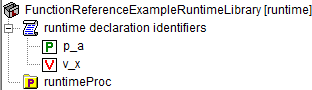

.. aimms:function:: me::Create(name, newType, parentId, pos)

.. _me::Create:

me::Create
==========

The function :aimms:func:`me::Create` creates a runtime identifier.

.. code-block:: aimms

    me::Create(
            name,     ! (input) a string
            newType,  ! (input) an element
            parentId, ! (input) an element
            pos       ! (optional) an integer
    )

Arguments
---------

    *name*
        A string that is valid name for a runtime identifier.

    *newType*
        An element in the set :aimms:set:`AllIdentifierTypes`.

    *parentId*
        An element in the set :aimms:set:`AllSymbols` referencing a runtime identifier.

    *pos*
        1 is the first position, and 0 means "place at end", the default is 0.

Return Value
------------

    Returns an element in :aimms:set:`AllSymbols` if successful or the empty element
    otherwise. In the latter case error(s) have been raised. When
    ``runtimeId`` doesn't reference a runtime identifier an error will be
    raised.

Example
-------

Viewing a small runtime library with prefix ``frerl`` in the model explorer:

.. figure:: images/runtimelib-setup.png
    :align: center

Let ``ep_functionReferenceExampleRuntimeDeclSec`` have value ``frerl::runtime_declaration_identifiers``, then the code:

.. code-block:: aimms

    me::Create(
        name     :  "v_x", 
        newType  :  'variable', 
        parentId :  ep_functionReferenceExampleRuntimeDeclSec, 
        pos      :  0);

inserts a variable at the end of the declaration section, thus changing that library to the following:

Illustrating that a runtime library can grow at runtime.

References
-----------

    *  :aimms:func:`me::Delete` 

    *  :aimms:func:`me::CreateLibrary` 

    *  :aimms:func:`me::Move` 

    *  :aimms:func:`me::SetAttribute`.

Generic references for model edit functions can be found on the `index page <https://documentation.aimms.com/functionreference/model-handling/model-edit-functions/index.html>`_
