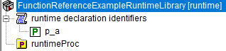

.. aimms:function:: me::Delete(runtimeId)

.. _me::Delete:

me::Delete
==========

The procedure :aimms:func:`me::Delete` a runtime identifier and all runtime
identifiers below that identifier.

.. code-block:: aimms

    me::Delete(
            runtimeId  ! (input) an element
    )

Arguments
---------

    *runtimeId*
        An element in the set :aimms:set:`AllIdentifiers` referencing a runtime identifier.

Return Value
------------

    Returns 1 if the delete operation is successful, 0 otherwise. In the
    latter case error(s) have been raised. When ``runtimeId`` doesn't
    reference a runtime identifier an error will be raised.

Example
-------

Viewing a small runtime library with prefix ``frerl`` in the model explorer:

Let ``ep_functionReferenceExampleRuntimeParameter`` have value ``frerl::p_a``, then the code:

.. code-block:: aimms

    me::Delete( ep_functionReferenceExampleRuntimeParameter );

deletes that parameter from the declaration section, thus changing that library to the following:

Illustrating that a runtime library can shrink at runtime.

References
-----------

    *   :aimms:func:`me::Children` 

    *   :aimms:func:`me::GetAttribute`.

Generic references for model edit functions can be found on the `index page <https://documentation.aimms.com/functionreference/model-handling/model-edit-functions/index.html>`_

