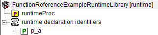

.. aimms:function:: me::Move(runtimeId, parentid, pos)

.. _me::Move:

me::Move
========

The procedure :aimms:func:`me::Move` renames a runtime identifier. In addition,
when the move changes the namespace of the runtime identifier all text
within the runtime library referencing that runtime identifier will be
adapted accordingly.

.. code-block:: aimms

    me::Move(
            runtimeId,  ! (input) an element
            parentid,   ! (input) an element
            pos         ! (input) integer
    )

Arguments
---------

    *runtimeId*
        An element in the set :aimms:set:`AllIdentifiers` referencing a runtime identifier.

    *parentid*
        An element in the set :aimms:set:`AllIdentifiers` referencing a runtime identifeir in the
        same runtime library.

    *pos*
        An integer position in the section. 1 is the first position, and 0 means
        "place at end".

Return Value
------------

    Returns 1 if the move operation is successful, 0 otherwise. In the
    latter case error(s) have been raised. When ``runtimeId`` doesn't
    reference a runtime identifier an error will be raised.

    .. note::

        The name change file is not supported for runtime libraries.

Example
-------

Viewing a small runtime library with prefix ``frerl`` in the model explorer:

.. figure:: images/runtimelib-setup.png
    :align: center

|

Let 

*   ``ep_functionReferenceExampleRuntimeLib`` refer to the root of the runtime library, and

*   ``ep_functionReferenceExampleRuntimeProc`` refer to a procedure inside the library, then the code:

.. code-block:: aimms

    me::Move(
        runtimeId :  ep_functionReferenceExampleRuntimeProc, 
        parentId  :  ep_functionReferenceExampleRuntimeLib , 
        pos       :  1);

moves the procedure to the front of the library, as shown below:

illustrating that a runtime library can be reorganized at runtime.

.. seealso::

    - :aimms:func:`me::ChangeType`.  
    - :aimms:func:`me::Rename`.
	- :aimms:func:`me::Move` plays a central role in `Runtime functions with arguments <https://how-to.aimms.com/Articles/517/517-runtime-functions-with-arguments.html>`_.
    - Generic references for model edit functions can be found on the `index page <https://documentation.aimms.com/functionreference/model-handling/model-edit-functions/index.html>`_.
