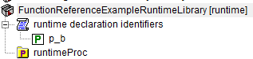

.. aimms:function:: me::Rename(runtimeId, newname)

.. _me::Rename:

me::Rename
==========

The procedure :aimms:func:`me::Rename` renames a runtime identifier. In addition,
all text within the runtime library referencing that runtime identifier
will be adapted accordingly.

.. code-block:: aimms

    me::Rename(
            runtimeId,  ! (input) an element
            newname     ! (input) a string
    )

Arguments
---------

    *runtimeId*
        An element in the set :aimms:set:`AllIdentifiers` referencing a runtime identifier.

    *newname*
        A string.

Return Value
------------

    Returns 1 if the rename operation is successful, 0 otherwise. In the
    latter case error(s) have been raised. When ``runtimeId`` doesn't
    reference a runtime identifier an error will be raised.

.. note::

    The name change file is not supported for runtime libraries.

Example
-------

Viewing a small runtime library with prefix ``frerl`` in the model explorer:

.. figure:: images/runtimelib-setup.png
    :align: center

Let 

*   ``ep_functionReferenceExampleRuntimeParameter`` refer to the parameter in the runtime library then the code:

.. code-block:: aimms

	me::Rename(
		runtimeId :  ep_functionReferenceExampleRuntimeParameter, 
		newName   :  "p_b");

renames the parameter as shown below:

References
-----------

    *   :aimms:func:`me::ChangeType`  

    *   :aimms:func:`me::Move`
	
Generic references for model edit functions can be found on the `index page <https://documentation.aimms.com/functionreference/model-handling/model-edit-functions/index.html>`_

