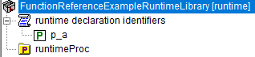

.. aimms:function:: me::SetAnnotation(runtimeId, key, value)

.. _me::SetAnnotation:

me::SetAnnotation
=================

The procedure :aimms:func:`me::SetAnnotation` changes an annotation of a runtime
identifier.

.. code-block:: aimms

    me::SetAnnotation(
            runtimeId,  ! (input) an element
            key,        ! (input) name of annotation
            value       ! (input) a string expression
    )

Arguments
---------

    *runtimeId*
        An element in the set :aimms:set:`AllIdentifiers` referencing a runtime identifier.

    *key*
        A string that is a valid annotation key.

    *value*
        The text to be assigned.  

Return Value
------------

    Returns 1 if the text assignment to the attribute is successful, 0
    otherwise. In the latter case error(s) have been raised. When
    ``runtimeId`` doesn't reference a runtime identifier an error will be
    raised.

Example
-------

Viewing a small runtime library with prefix ``frerl`` in the model explorer:

|

Let 

*   ``ep_functionReferenceExampleRuntimeParameter`` refer to the parameter in the runtime library, then the code:

.. code-block:: aimms

    me::SetAnnotation(
        runtimeId :  ep_functionReferenceExampleRuntimeParameter, 
        key       :  "webui::TooltipIdentifier", 
        value     :  "chapterModel::sectionModelEdit::funcMeSetAnnotation::sp_tooltipRuntimeIdentifier");
    me::Compile( ep_functionReferenceExampleRuntimeLib );
    GetAnnotationValues("webui::TooltipIdentifier",_sp_rtd);
    _sp_annot := _sp_rtd( ep_functionReferenceExampleRuntimeParameter );
    display _sp_annot ;

produces the following in the listing file:

.. code-block:: aimms

    _sp_annot := "chapterModel::sectionModelEdit::funcMeSetAnnotation::sp_tooltipRuntimeIdentifier" ;

.. seealso::

    - :aimms:func:`me::ChangeType`.  
    - :aimms:func:`me::Rename`.
    - Generic references for model edit functions can be found on the `index page <https://documentation.aimms.com/functionreference/model-handling/model-edit-functions/index.html>`_.
